# Introduction

> This document describes briefly the steps needed to run the Python code to manage our proposed EMG Database. We implemented a Real-Time Hand Gesture Recognition based on Artificial Feed-Forward Neural Networks to test the data of each user.

## Description

> The “Hand Gesture Model Example PYTHON” folder contains the Python code to manage the EMG Database. Each script contains a description of its function as well as the copyright information. If you want to use the dataset and the code for commercial purposes, please contact to the correspondent author of the paper, Marco E. Benalcázar, to the email addresses: 

* marco.benalcazar@epn.edu.ec 
* marco_benalcazar@hotmail.com

## Description

* Python 3.7
* Anaconda
* Spyder 4.1.3

## Instructions for Python:

1. Install ANACONDA and Spyder 4.0.1
    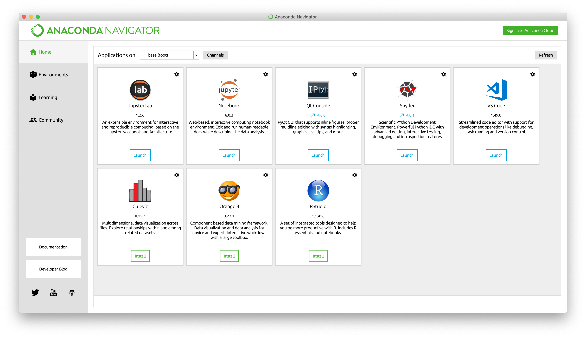

2. Create a virtual environment. 
    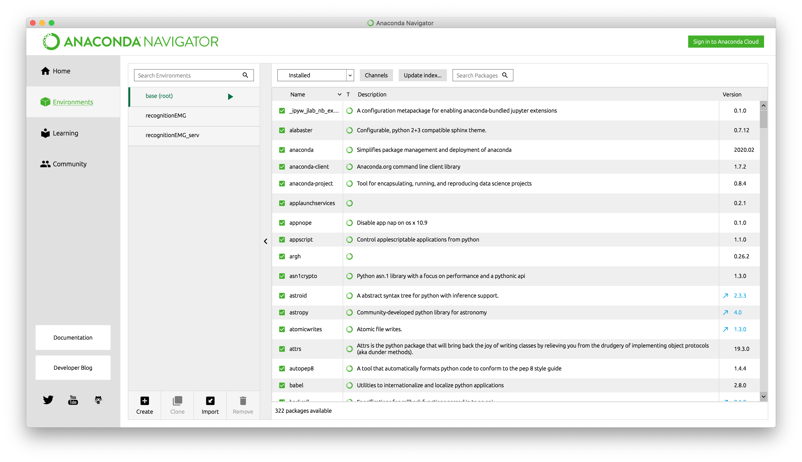

3. Install the latest updates of the following libraries:

  - pip:
    - absl-py==0.9.0
    - astor==0.8.1
    - cycler==0.10.0
    - cython==0.29.19
    - dtaidistance==1.2.3
    - dtw==1.4.0
    - dtw-python==1.0.5
    - fastdtw==0.3.4
    - gast==0.3.3
    - google-pasta==0.2.0
    - grpcio==1.29.0
    - imagesc==0.1.8
    - joblib==0.15.1
    - keras==2.3.1
    - keras-applications==1.0.8
    - keras-preprocessing==1.1.2
    - markdown==3.2.2
    - matplotlib==3.2.1
    - numpy==1.18.4
    - pandas==1.0.4
    - protobuf==3.12.2
    - pyfftw==0.12.0
    - scikit-learn==0.23.1
    - seaborn==0.10.1
    - simplespectral==1.0.0
    - tensorboard==1.14.0
    - tensorflow==1.14.0
    - tensorflow-estimator==1.14.0
    - termcolor==1.1.0
    - theano==1.0.4
    - threadpoolctl==2.1.0
    - werkzeug==1.0.1

4. Go to our GitHub repository and download or clone the example to manage the dataset in Python [Example](https://github.com/laboratorioAI/DTW_ANN_EPN_Python).

    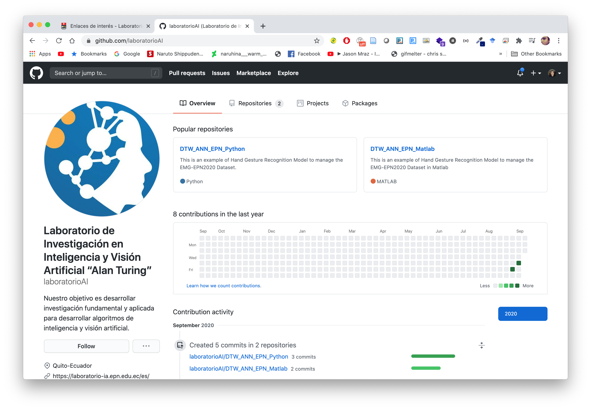

5. Open Python and choose the example folder.

    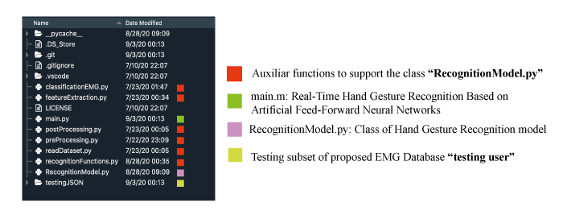

6. Download the dataset before running the code from the following link: 
   
   * [EMG-EPN612 Dataset](https://laboratorio-ia.epn.edu.ec/es/recursos/dataset/2020_emg_dataset_612)

    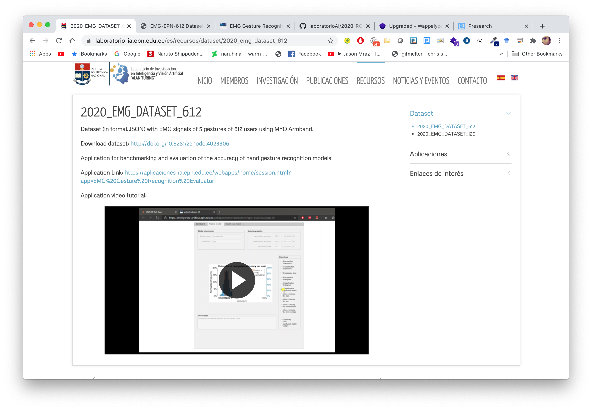

    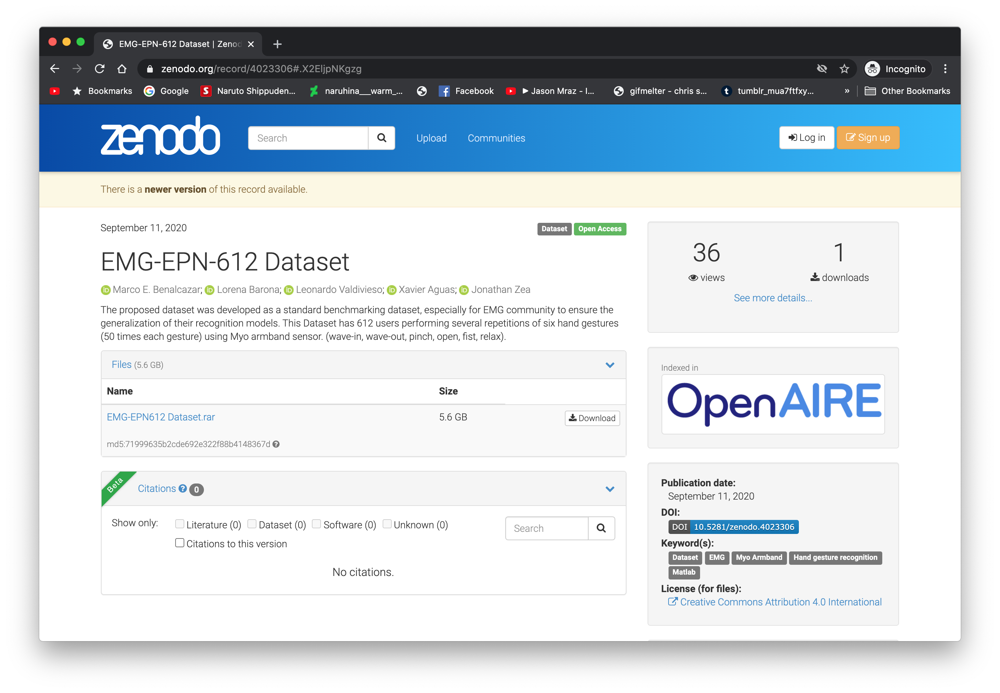

7. Copy and replace the folders corresponding to the dataset in the downloaded repository folder.
   
   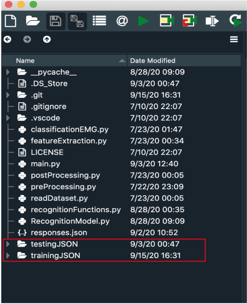

8. Run the script **main.m** After running this script, you will have to wait several minutes to obtain the results. In the variable "folderData" you can change for testingJSON or trainingJSON to choose the user group. In our case, we classified six gestures corresponding to 306 testing users.

    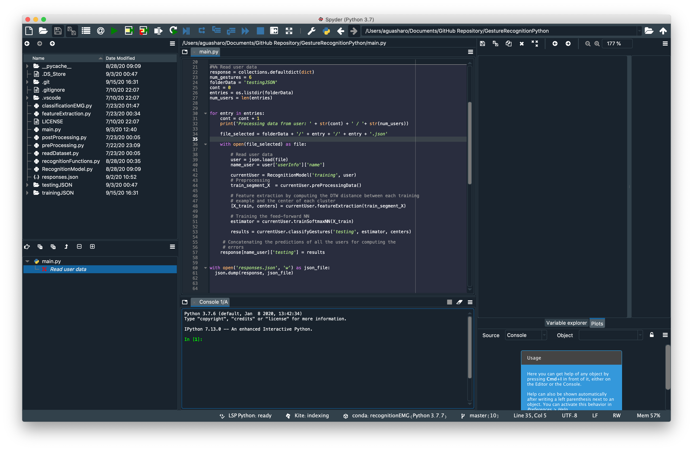

9.  The code starts running and analyzes all users. You can observe the progress of the code by observing the command window.

    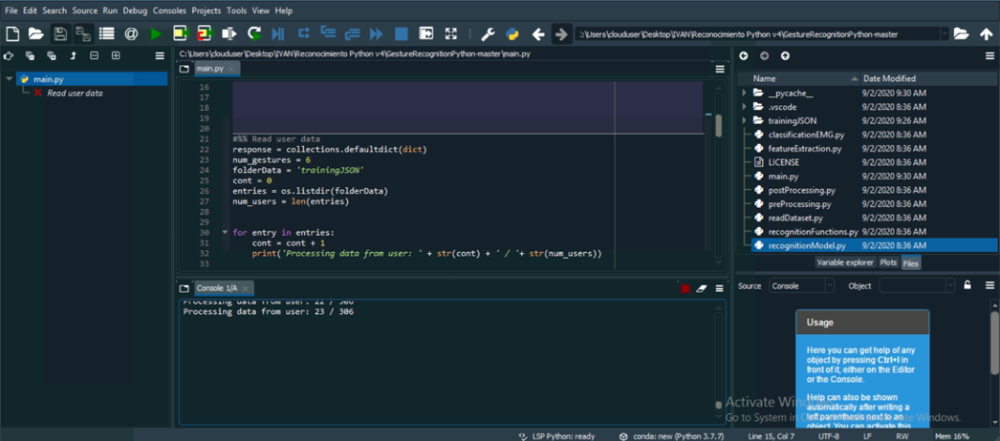

10. At the end of analyzing all users, the code automatically generates a .json file with the responses of each of the users.

    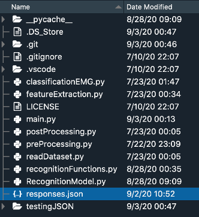

11. The “responses.json” file has the following structure:

    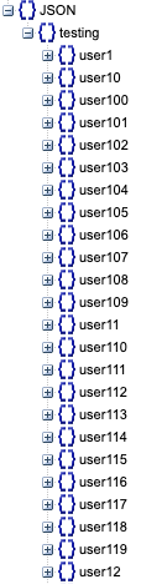

12. The responses corresponding to each user are divided as shown below:

    * vectorOfLabels:  Vector with the predicted labels for the sliding windows of each sample.

    * vectorOfTimePoints:  Vector with the time corresponding to the predicted labels of vectorOfLabels.

    * vectorOfProcessingTime: Vector with the processing times corresponding to the analysis of each sliding window.

    * class:  The most frequent label (mode) in the vectorOfLabels.

    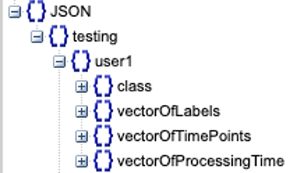

The sample responses for the fields mentioned above (*vectorOfLabels*, *vectorOfTimePoints*, *vectorOfProcessingTimes*, *class*) are stored from **idx_0** to **idx_149**. Each user has 150 samples analyzed by the hand gesture recognition model.

  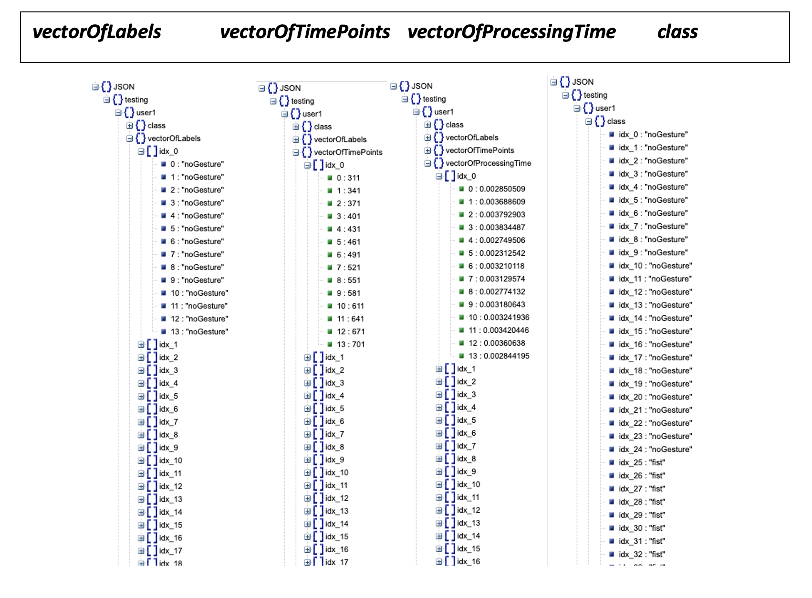

11. In order to obtain the score of your model, it is necessary to register your data and upload your responses on our platform.  The link is as follows:
[Evaluation System](https://aplicaciones-ia.epn.edu.ec/webapps/home/session.html?app=EMG%20Gesture%20Recognition%20Evaluator).

    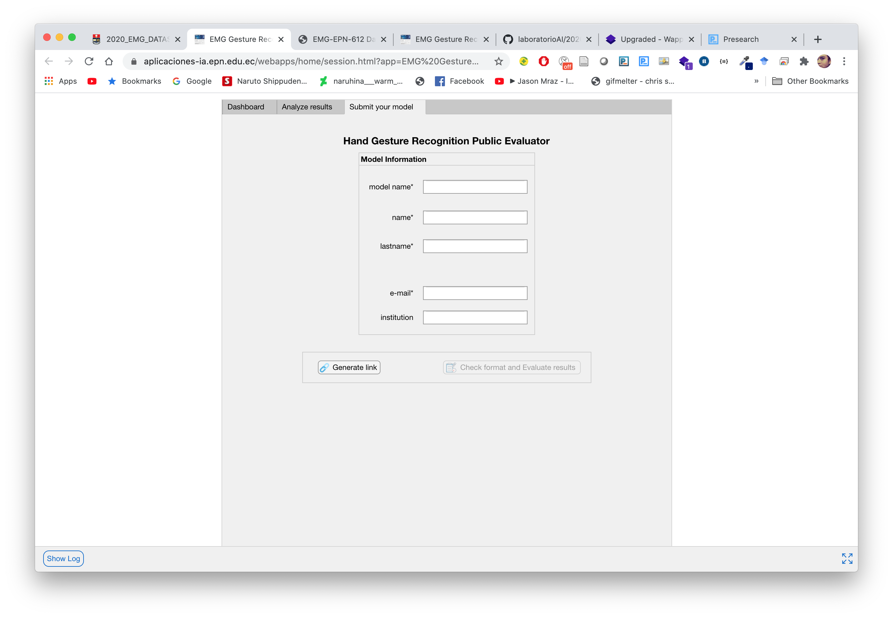

12. A link is generated to upload the json file with the responses. The link to upload the files is sent to the registered email.
    
    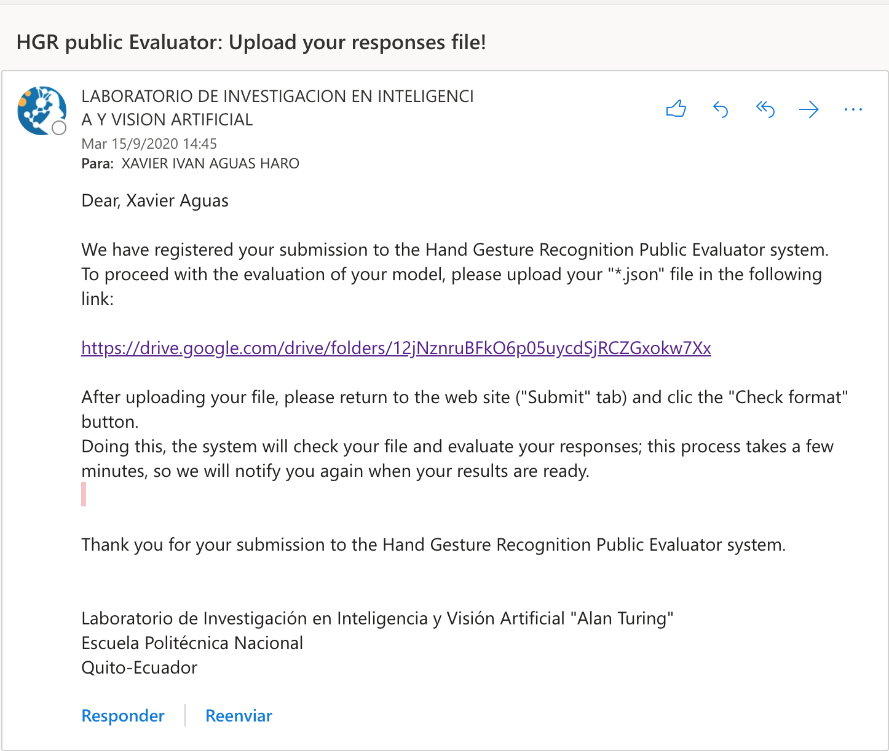

13. The reports contain information about classification and recognition accuracy per user, histogram of classification and recognition per user, ,time processing of model, confusion matrix, classification and recognition detailed by gender, handedness, users with arm injury and finally a .txt file with the general summary report of the model. 

    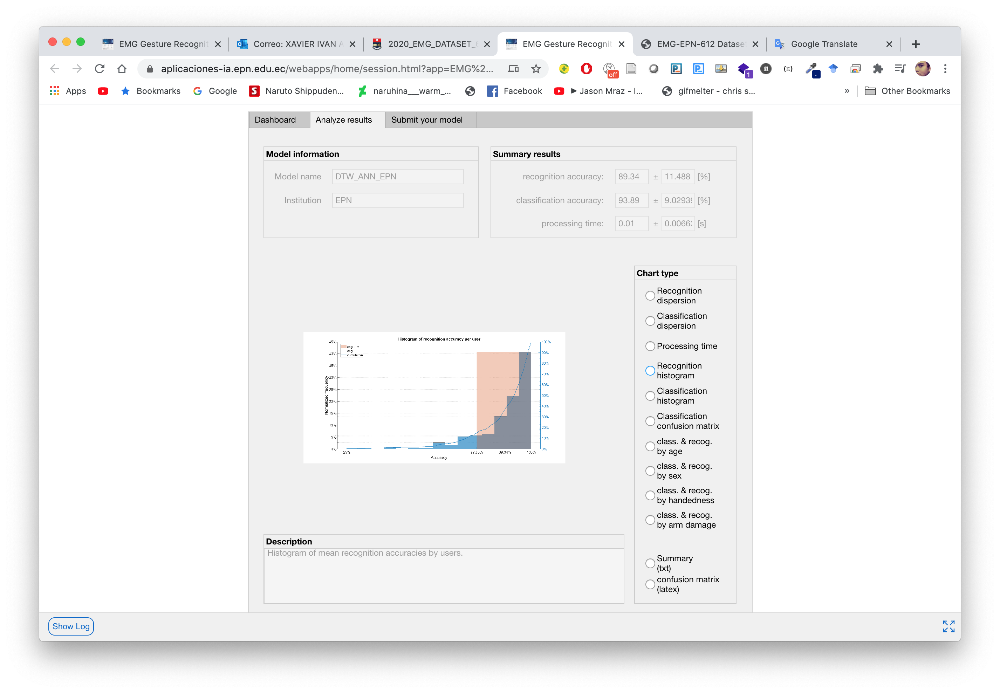

14. The scores are shown to the public in order to maintain transparency between the results of the models given by the EMG community.

    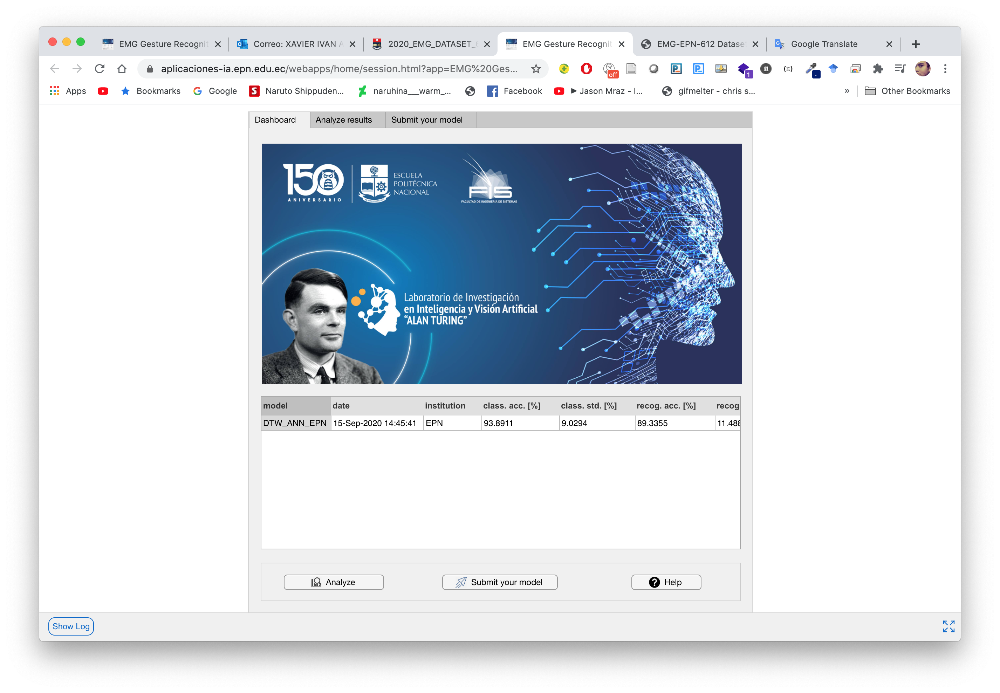
